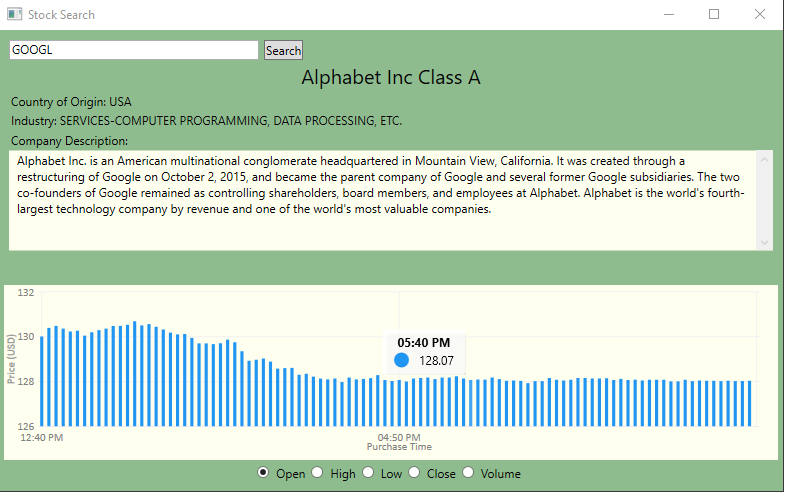

# Stock Searching App

## _Overview_

The Stock Searching App shows company and pricing information for any stock based on data from that day. It uses the Alpha Vantage API for searching and retrieving public company and stock data.

This application was written in C#/.NET with the Microsoft Windows Presentation Foundation (WPF) UI framework.

### Setup
1. Navigate to the link (https://www.alphavantage.co/support/#api-key) and get access to a free API key.
    - Note: Make sure to save the API key to a local file. After you close the browser, you wont be able to see the key again.
2. Navigate to the file `ViewModel/StockSearchHelper.cs` and paste your `API Key` into the string on line 15. 

### How It Works

Enter the stock symbol of the desired company you are interested in searching. After pressing the `ENTER` key or the `Search` button, the company information and stock price graph will populate. Toggle through the options below the graph to see different information about that day's performance.

#### Development

This tool was written in C#/.NET and was creating using the Microsoft Windows Presentation Foundation UI framework. Free use for everyone. MIT License.